# One Stop EShop

**Everything you love, in one place.** A modern, full-stack e-commerce store built with the MERN stack: React 19, shadcn/ui and Tailwind CSS 4 on the front, Express 5, Mongoose 9 and MongoDB on the back, with PayPal checkout.

**Live demo:** [one-stop-eshop.vercel.app](https://one-stop-eshop.vercel.app/)

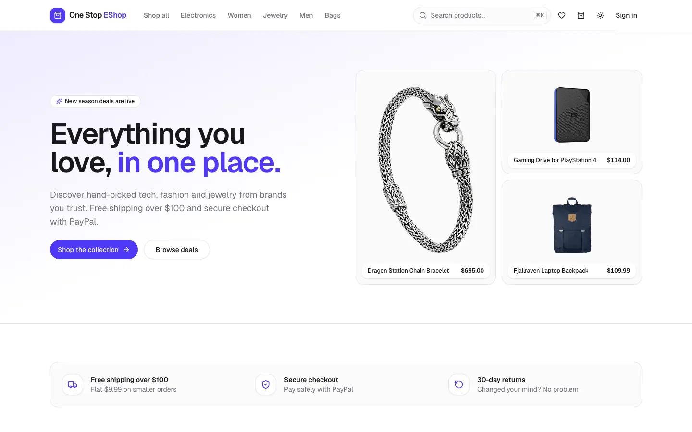

## Features

**Shopping**

- Home page with a hero, category tiles, featured picks, deals and top-rated products
- Shop page with category, brand, price-range, in-stock and on-sale filters, plus sorting and pagination. Filters live in the URL, so results are shareable.
- ⌘K / Ctrl+K search across products, brands and categories, with recent searches
- Product pages with an image gallery, real sale prices, stock status, related products and a recently viewed list
- Star ratings and reviews (one per customer) with a rating breakdown and **Verified purchase** badges
- Wishlist that syncs to your account
- Cart drawer and cart page with a free-shipping progress bar

**Checkout and orders**

- Multi-step checkout: shipping address → review → place order → pay with PayPal
- Prices, shipping (free over $100) and stock are always calculated on the server
- Order pages with a status timeline (placed → paid → shipped → delivered) and cancellation of unpaid orders
- With a PayPal client secret configured, the server captures each payment itself. It first re-checks the order, its stock and the amount. A PayPal payment can never pay for two orders.

**Admin dashboard**

- Revenue, order, customer and product stats, a 30-day revenue chart, orders by status, recent orders and low-stock alerts
- Product management: search, create, edit, show/hide, featured flag, and images from the bundled library or a URL, with a live preview
- Order management: filter by status, mark shipped or delivered, cancel
- Customer management: grant or remove admin access, delete accounts

**Experience**

- Light, dark and system themes
- Responsive layout down to small phones
- Accessible components built on Radix primitives
- Skeleton loading states and empty states throughout
- No zoom-on-focus for form fields on iOS, while pinch-zoom still works
- SEO: per-page titles and descriptions, canonical URLs, Open Graph and Twitter cards, Product and WebSite structured data, robots.txt and a sitemap

**Performance**

- Every page is loaded on demand, and the PayPal SDK only loads on an unpaid order page
- About 175 kB of gzipped JavaScript on first load, enforced by a bundle budget check
- Page data is requested while the page's code is still downloading, and hovering a product preloads its page
- Self-hosted Geist variable font
- Product images are WebP and lazy-loaded

## Screenshots

|                                                                   |                                                         |
| ----------------------------------------------------------------- | ------------------------------------------------------- |
| 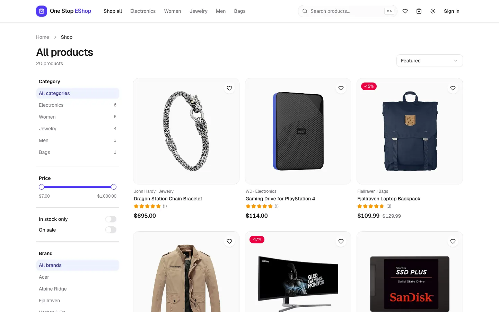                  | 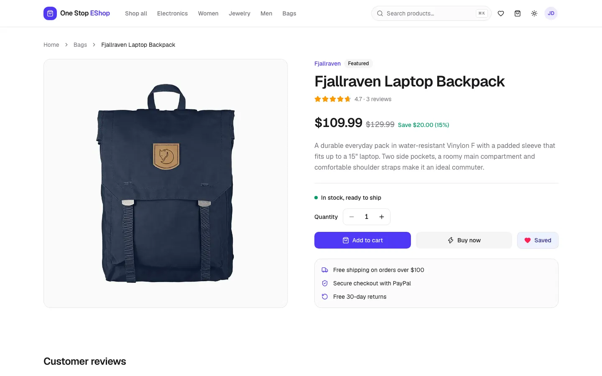          |
| 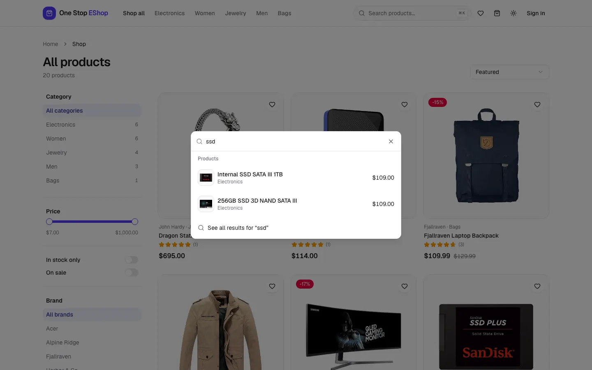                           | 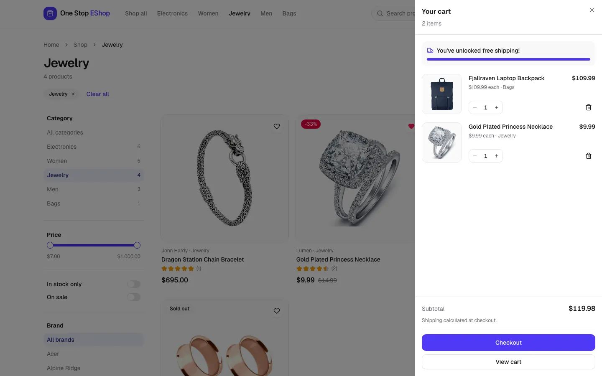        |
| 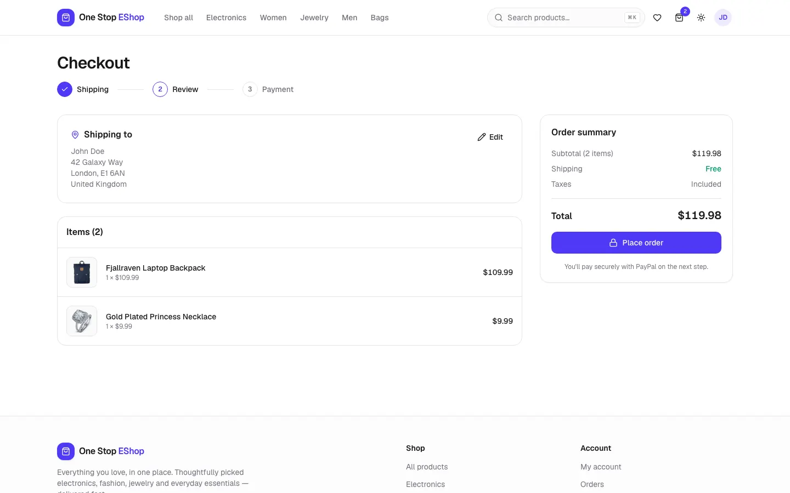                | 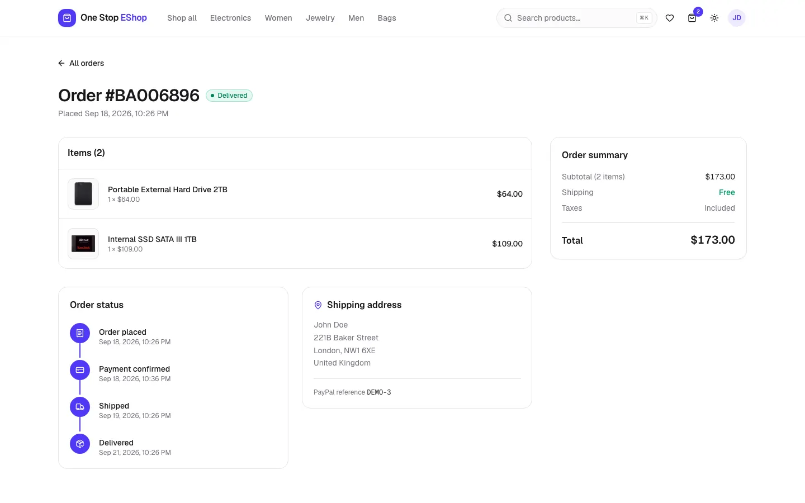   |
| 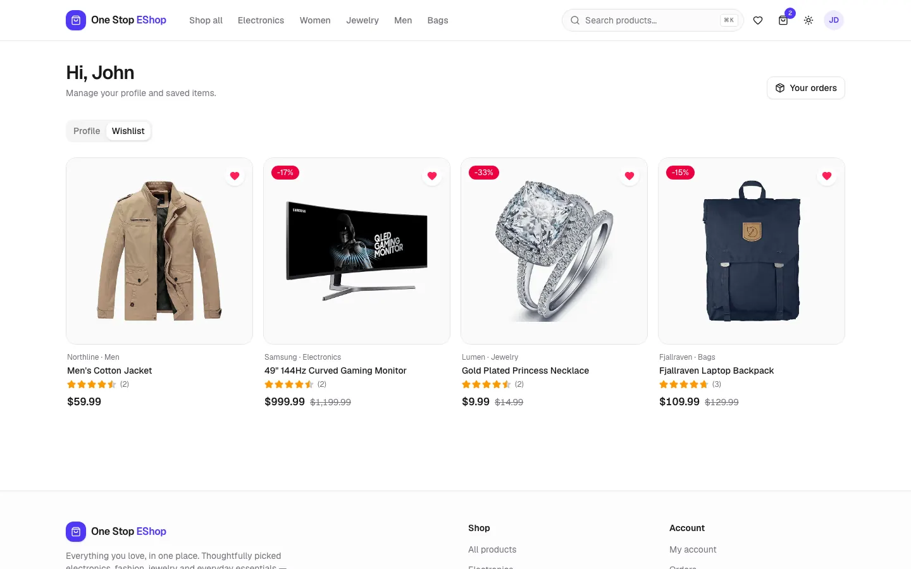                       | 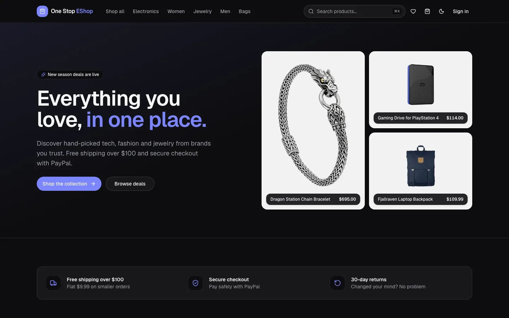           |
| 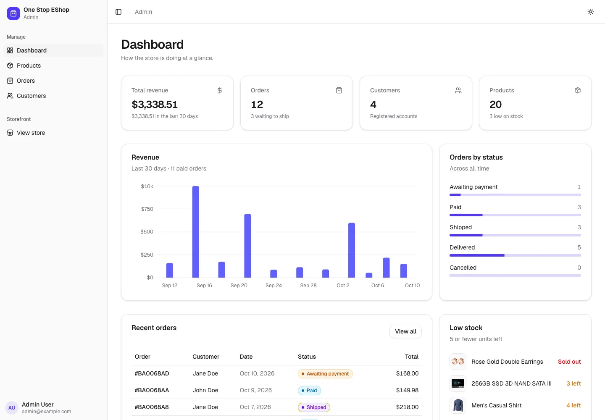         | 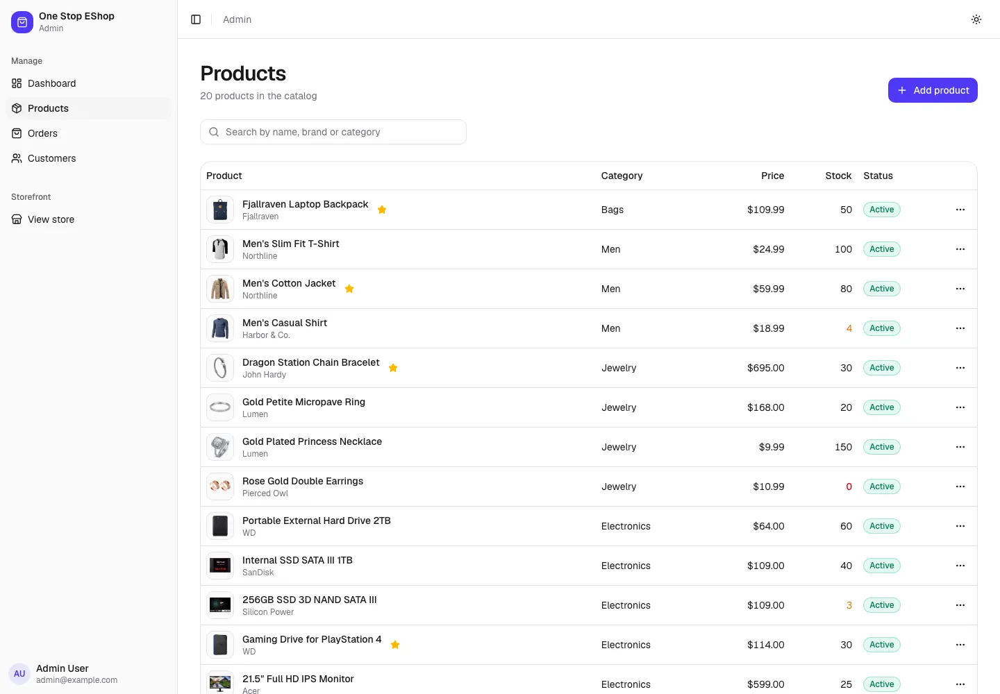 |
| 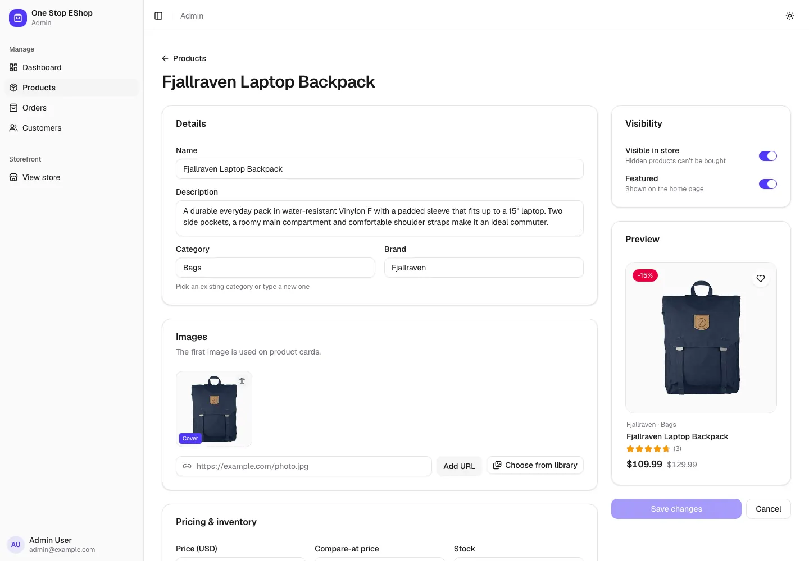 | 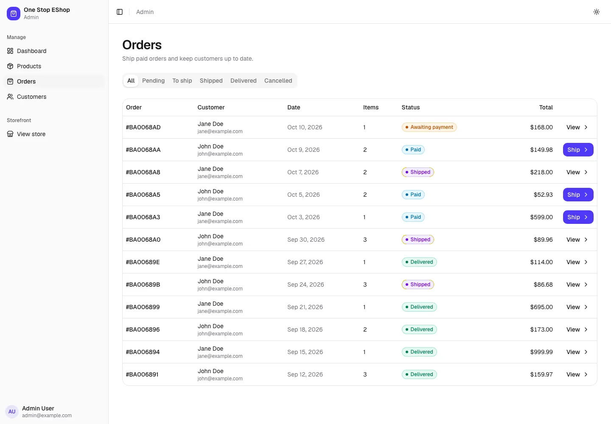     |

<p align="center">
  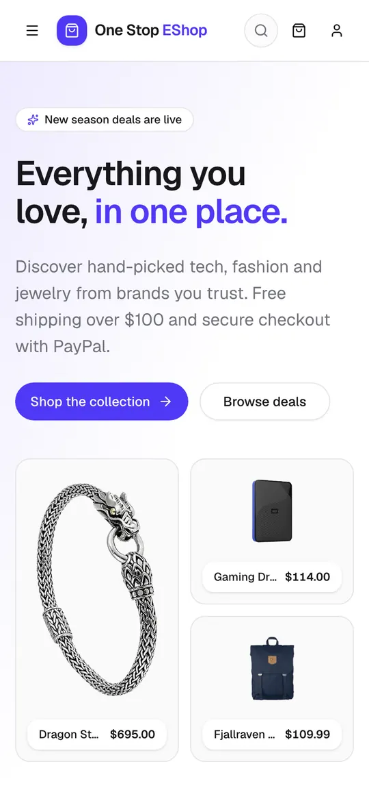
  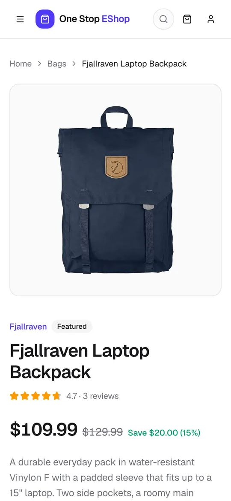
  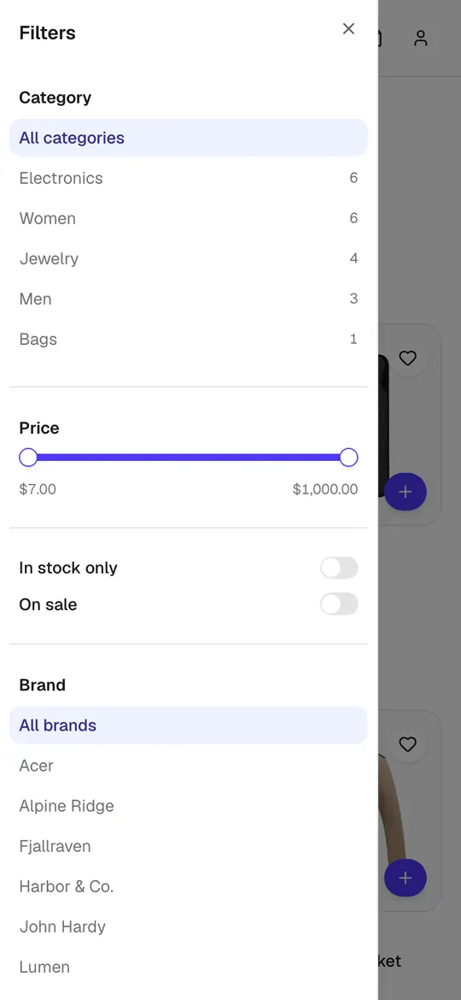
</p>

## Run it locally

Requirements: **Node.js 22** and a **MongoDB** database (MongoDB Atlas, or a local `mongod` / Docker container).

```bash
git clone https://github.com/iamsomraj/MERN-Shopping-App.git
cd MERN-Shopping-App
```

Copy `.env.example` to `.env` in both `backend/` and `frontend/` and fill in the values. Every variable is documented in [backend/README.md](backend/README.md#environment-variables) and [frontend/README.md](frontend/README.md#environment-variables). At minimum the API needs `MONGODB_URI` and `SECRET`, and the frontend needs `VITE_DEVELOPMENT_API=http://localhost:4500`.

```bash
cd backend
npm install
npm run up      # seeds users, 20 products, reviews and demo orders (deletes existing data!)
npm run dev     # API on http://localhost:4500

# in a second terminal
cd frontend
npm install
npm run dev     # store on http://localhost:5173
```

Sample logins (password `123456`):

- `admin@example.com` (admin)
- `john@example.com`
- `jane@example.com`

The login page also has one-click demo buttons.

> **Deploying this version?** The data model changed, so reseed the database with `npm run up` (from `backend/`, with `MONGODB_URI` pointing at it). This wipes all existing users, products and orders and loads fresh demo data.

## Quality checks

Run every check for both apps from the repo root before opening a pull request:

```bash
npm run check   # backend: lint, format, typecheck, tests, build · frontend: lint, format, typecheck, build, bundle budget
```

Each app also has its own `npm run check`.

- **ESLint 9:** typescript-eslint, plus react-hooks and jsx-a11y on the frontend
- **Prettier:** formatting, with the Tailwind class-sorting plugin on the frontend
- **TypeScript:** strict mode in both apps
- **Backend tests:** about 60 Vitest + Supertest tests against an in-memory MongoDB. They never touch the database in your `.env`.
- **Bundle budget:** fails the frontend build if the JavaScript loaded on first visit grows past the limit

## Deployment

Both apps are deployed on Vercel as separate projects, built automatically from `main`:

| Project              | Root directory | URL                                     |
| -------------------- | -------------- | --------------------------------------- |
| `one-stop-eshop`     | `frontend`     | https://one-stop-eshop.vercel.app       |
| `one-stop-eshop-api` | `backend`      | https://somraj-mern-shop-api.vercel.app |

Set the environment variables in each Vercel project. The API also needs:

- `NODE_ENV=production`
- `PRODUCTION_CLIENT_ORIGIN=https://one-stop-eshop.vercel.app`
- MongoDB Atlas network access from anywhere (`0.0.0.0/0`)

Set `PAYPAL_CLIENT_SECRET` (and `PAYPAL_API_BASE` for live payments) to have the server capture PayPal payments.

When a release changes the data model, reseed the production database with `npm run up` as part of the deploy. It replaces all data with the demo catalog.

**Images:** product images are self-hosted in `frontend/public/images/products`. Vercel functions have a read-only filesystem, so admins pick images from that library or paste an image URL instead of uploading files.

## Tech stack

**Frontend:** React 19, Vite 8, TypeScript, React Router 7, TanStack Query 5, Zustand, Tailwind CSS 4, shadcn/ui (Radix UI), lucide-react, React Hook Form + Zod, Recharts, sonner, PayPal JS SDK, Geist font

**Backend:** Node 22, Express 5, TypeScript, Mongoose 9, MongoDB, Zod, JSON Web Tokens, Vitest + Supertest + mongodb-memory-server

**Tooling:** ESLint 9, Prettier, changelogen, Vercel

## Releases

Versions and the [CHANGELOG](CHANGELOG.md) are generated with [changelogen](https://github.com/unjs/changelogen) from [Conventional Commits](https://www.conventionalcommits.org/), for example `feat(backend): ✨ …` or `fix(frontend): 🐛 …`. To cut a release from an up-to-date `main`:

```bash
npm install                                               # once, in the repo root
npm run release                                           # bump version, update CHANGELOG.md, commit, tag, push
GITHUB_TOKEN=$(gh auth token) npx changelogen gh release  # publish the GitHub Release
```

## Developer

LinkedIn: [iamsomraj](https://www.linkedin.com/in/iamsomraj/) 😊

Portfolio: [Somraj Mukherjee](https://iamsomraj.github.io/) 😊

## Show your support

Give the repo a star ⭐ if this project helped you.

## Contributing

Pull requests are welcome. 🤝 For major changes, please open an issue first to discuss what you would like to change.

Please use Conventional Commits and make sure `npm run check` passes.

## License

[MIT](https://choosealicense.com/licenses/mit/) 📰
